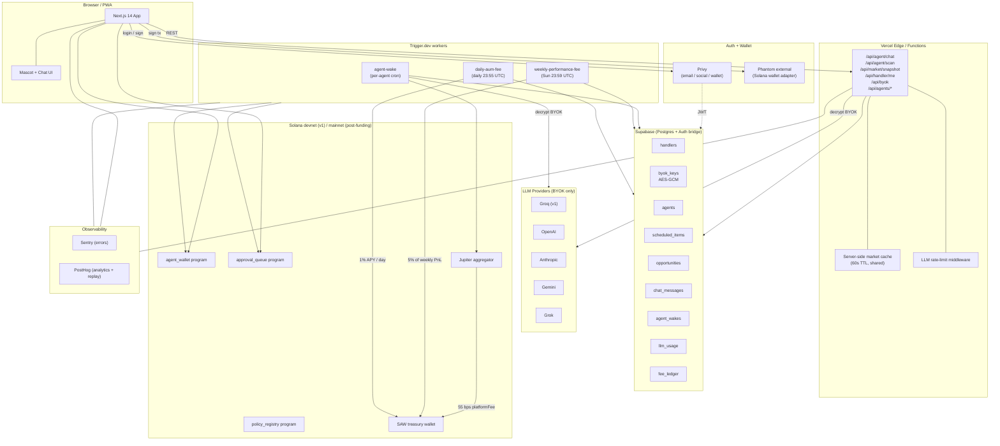

# SAW Architecture

## System diagram



## Module map

```
saw/
├── programs/                    Anchor on-chain code (Rust)
│   ├── agent_wallet/
│   ├── policy_registry/
│   └── approval_queue/
├── sdk/                         @asastuai/saw-sdk (TypeScript)
│   ├── client.ts                SawClient
│   ├── wallet-handle.ts         WalletHandle
│   ├── policy.ts                Policy helpers
│   └── pdas.ts                  PDA derivations
├── web/                         @asastuai/saw-web (Next.js 14)
│   ├── app/
│   │   ├── api/
│   │   │   ├── agent/{chat,scan,wake}/route.ts
│   │   │   ├── byok/route.ts
│   │   │   ├── handler/me/route.ts
│   │   │   └── market/snapshot/route.ts
│   │   ├── demo/page.tsx
│   │   ├── dashboard/page.tsx          [P4]
│   │   └── layout.tsx
│   ├── components/
│   │   ├── privy-provider.tsx
│   │   ├── mascot.tsx
│   │   ├── chat.tsx
│   │   ├── schedule-view.tsx
│   │   ├── opportunity-reel.tsx
│   │   ├── api-key-modal.tsx
│   │   ├── creator-note.tsx
│   │   └── error-boundary.tsx
│   ├── lib/
│   │   ├── supabase.ts
│   │   ├── byok-crypto.ts
│   │   ├── fees.ts
│   │   ├── treasury.ts
│   │   ├── jupiter.ts
│   │   ├── posthog.ts
│   │   ├── db/
│   │   │   ├── types.ts
│   │   │   ├── handlers.ts
│   │   │   ├── agents.ts
│   │   │   ├── schedule.ts
│   │   │   ├── opportunities.ts
│   │   │   ├── chat.ts
│   │   │   ├── byok.ts
│   │   │   ├── fees.ts
│   │   │   └── llm.ts
│   │   └── providers/
│   │       ├── types.ts
│   │       ├── groq.ts
│   │       └── index.ts          (registry)
│   └── sentry.{client,server,edge}.config.ts
├── worker/                      @asastuai/saw-worker (Trigger.dev)
│   ├── trigger.config.ts
│   └── src/
│       ├── jobs/
│       │   ├── agent-wake.ts
│       │   ├── weekly-performance-fee.ts
│       │   └── daily-aum-fee.ts
│       └── lib/
│           ├── supabase.ts
│           ├── market.ts
│           └── fees.ts
├── db/
│   └── migrations/
│       └── 0001_init.sql
├── docs/
│   ├── architecture.md
│   ├── security-model.md
│   └── fee-model.md
└── ROADMAP.md
```

## Data ownership

| Layer | Owns | Reads from | Writes to |
|---|---|---|---|
| Browser | UI state, ephemeral form data | API routes | API routes only |
| API routes | request handling, RLS-bound queries | Supabase (anon, via Privy JWT) | Supabase (service role for cross-handler ops) |
| Worker jobs | agent runtime, fee collection | Supabase (service role), on-chain | Supabase (service role), on-chain |
| On-chain programs | custody, policy enforcement | — | — |

## Critical invariants

1. **Plaintext BYOK keys never leave the server's RAM.** Encrypted at rest in Supabase (AES-GCM), decrypted only inside the worker / API route that needs them.
2. **RLS on every table.** Handlers can only see their own data via Privy JWT. Service role (workers) bypasses for system operations.
3. **No agent acts without a registered policy on-chain.** The agent wallet program enforces this; the worker cannot circumvent.
4. **All fees recorded in fee_ledger before/after on-chain collection.** Single source of truth for revenue.
5. **Cron cadence is per-agent.** No global "tick" that fires all agents at once — they wake on independent schedules to spread load.
