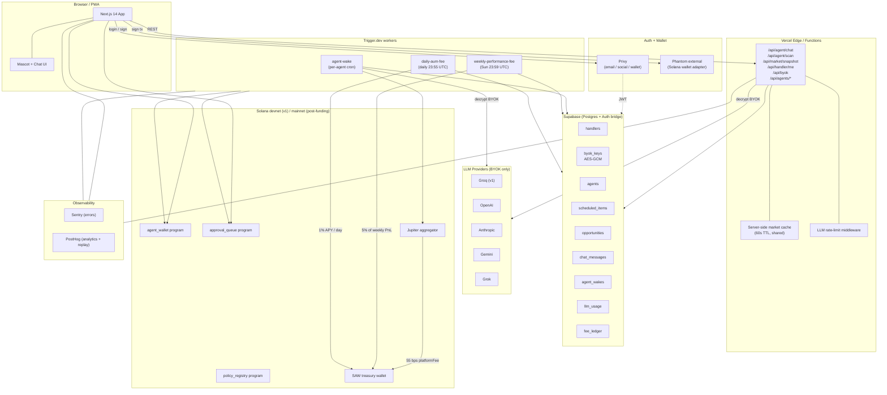
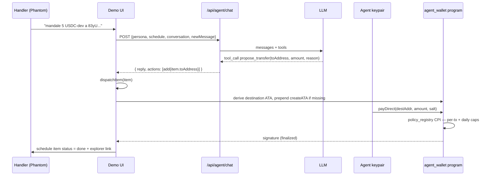
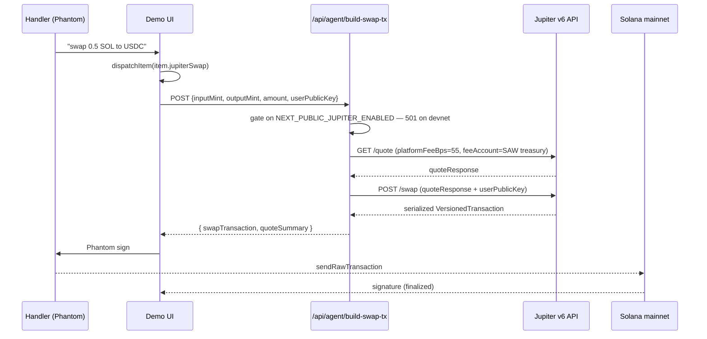

# SAW Architecture

## System diagram



## Module map

```
saw/
├── programs/                    Anchor on-chain code (Rust)
│   ├── agent_wallet/
│   ├── policy_registry/
│   └── approval_queue/
├── sdk/                         @asastuai/saw-sdk (TypeScript)
│   ├── client.ts                SawClient
│   ├── wallet-handle.ts         WalletHandle
│   ├── policy.ts                Policy helpers
│   └── pdas.ts                  PDA derivations
├── web/                         @asastuai/saw-web (Next.js 14)
│   ├── app/
│   │   ├── api/
│   │   │   ├── agent/{chat,scan,wake}/route.ts
│   │   │   ├── byok/route.ts
│   │   │   ├── handler/me/route.ts
│   │   │   └── market/snapshot/route.ts
│   │   ├── demo/page.tsx
│   │   ├── dashboard/page.tsx          [P4]
│   │   └── layout.tsx
│   ├── components/
│   │   ├── privy-provider.tsx
│   │   ├── mascot.tsx
│   │   ├── chat.tsx
│   │   ├── schedule-view.tsx
│   │   ├── opportunity-reel.tsx
│   │   ├── api-key-modal.tsx
│   │   ├── creator-note.tsx
│   │   └── error-boundary.tsx
│   ├── lib/
│   │   ├── supabase.ts
│   │   ├── byok-crypto.ts
│   │   ├── fees.ts
│   │   ├── treasury.ts
│   │   ├── jupiter.ts
│   │   ├── posthog.ts
│   │   ├── db/
│   │   │   ├── types.ts
│   │   │   ├── handlers.ts
│   │   │   ├── agents.ts
│   │   │   ├── schedule.ts
│   │   │   ├── opportunities.ts
│   │   │   ├── chat.ts
│   │   │   ├── byok.ts
│   │   │   ├── fees.ts
│   │   │   └── llm.ts
│   │   └── providers/
│   │       ├── types.ts
│   │       ├── groq.ts
│   │       └── index.ts          (registry)
│   └── sentry.{client,server,edge}.config.ts
├── worker/                      @asastuai/saw-worker (Trigger.dev)
│   ├── trigger.config.ts
│   └── src/
│       ├── jobs/
│       │   ├── agent-wake.ts
│       │   ├── weekly-performance-fee.ts
│       │   └── daily-aum-fee.ts
│       └── lib/
│           ├── supabase.ts
│           ├── market.ts
│           └── fees.ts
├── db/
│   └── migrations/
│       └── 0001_init.sql
├── docs/
│   ├── architecture.md
│   ├── security-model.md
│   └── fee-model.md
└── ROADMAP.md
```

## Data ownership

| Layer | Owns | Reads from | Writes to |
|---|---|---|---|
| Browser | UI state, ephemeral form data | API routes | API routes only |
| API routes | request handling, RLS-bound queries | Supabase (anon, via Privy JWT) | Supabase (service role for cross-handler ops) |
| Worker jobs | agent runtime, fee collection | Supabase (service role), on-chain | Supabase (service role), on-chain |
| On-chain programs | custody, policy enforcement | — | — |

## Critical invariants

1. **Plaintext BYOK keys never leave the server's RAM.** Encrypted at rest in Supabase (AES-GCM), decrypted only inside the worker / API route that needs them.
2. **RLS on every table.** Handlers can only see their own data via Privy JWT. Service role (workers) bypasses for system operations.
3. **No agent acts without a registered policy on-chain.** The agent wallet program enforces this; the worker cannot circumvent.
4. **All fees recorded in fee_ledger before/after on-chain collection.** Single source of truth for revenue.
5. **Cron cadence is per-agent.** No global "tick" that fires all agents at once — they wake on independent schedules to spread load.

---

## v1.3 changes (current)

### Unified Operative model

Three persona personas (Greedie / Conservador / Estable) collapsed into a single Operative per handler. Handler picks a custom codename in settings; the LLM context adapts intent (trade / yield / save) per message. Old persona rows kept readable for back-compat but new setups only mint an `operative`.

**Why:** the persona switcher added cognitive load with little upside — one chat handling all three skills is the natural product.

### Real on-chain transfer to arbitrary address (`propose_transfer`)

New LLM tool exposes `propose_transfer(toAddress, amount, reason)`. When the handler says "mandale 5 USDC-dev a `<pubkey>`", the Operative validates the address shape, queues a `ScheduleItem` with `item.toAddress` set, and `dispatchItem` routes the `payDirect` (or `requestPayment` + `approveAndExecute` above threshold) to the ATA derived from that address — creating the ATA on the fly if it doesn't exist (agent pays rent from its gas SOL).

End-to-end verified on devnet (sig `QCn46M6gZfQaYzXr9b3DzNSKp1xXRUEySZqwY1FB14iA4MtqmkWe8fwzZsv4jwDnTNrmtqjedCk2bR9Ag3VjwGz`, finalized). On-chain policy enforces per-tx + daily caps + approval threshold regardless of destination.

### Jupiter swap adapter (mainnet-gated)

New LLM tools:
- `get_jupiter_quote(inputSymbol, outputSymbol, amountLamports, slippageBps)` — always calls Jupiter v6 quote API for real mainnet pricing. Works on devnet too (read-only, no liquidity needed).
- `propose_jupiter_swap(...)` — queues a swap as a `ScheduleItem` with `jupiterSwap` descriptor.

The execute path is gated by `NEXT_PUBLIC_JUPITER_ENABLED`. On devnet (current) the queue accepts the item but `dispatchItem` returns a visible "mainnet pending" error. Mainnet deploy flips the flag and the same flow executes for real.

Server endpoint `POST /api/agent/build-swap-tx` builds the Jupiter tx with `platformFeeBps: 55` routed to `getTreasuryAddressString()` — the platform fee accrues to SAW on every swap.

### LLM provider tool-calling ranking

`/api/agent/chat` reorders the SAW-credits provider chain by tool-calling quality before invoking the LLM:

`cerebras > groq > anthropic > openai > grok > kimi > deepseek > gemini`

Why: Gemini Flash-Lite (cheap, free RPD tier) is weak with function calls in chat history with prior tool-success references — it generates `"Listo, propuse..."` text without emitting the tool call, leaving the schedule unchanged. Reorder pushes strong tool callers (Cerebras gpt-oss-120b, Groq llama-4) to the front so tools actually fire. Gemini stays in the chain as last-resort fallback only on transient errors.

BYOK keys (single-entry chains) are not reordered — that's the user's explicit choice.

### Security headers + audit pre-push

`next.config.mjs` now sets `X-Frame-Options: DENY`, `X-Content-Type-Options: nosniff`, `Referrer-Policy: strict-origin-when-cross-origin`, `Permissions-Policy` lock-down. Verified live in production.

14-bug internal audit closed before public push: 3 CRITICAL + 6 HIGH + 4 MEDIUM, zero open. Report at `docs/security-audit-v1.3.md`. JWT signature verification (CRITICAL pre-fix), wallet-claim immutability, internal-auth handler validation, IDOR closures on schedule + opportunities, topup signer check, anchor program hardenings (`require!(amount > 0)`, `validate_params`, `prune_expired_request`, `reset_daily_spent`).

---

## End-to-end flow: `propose_transfer` (verified on devnet)



## End-to-end flow: Jupiter swap (mainnet-gated)



