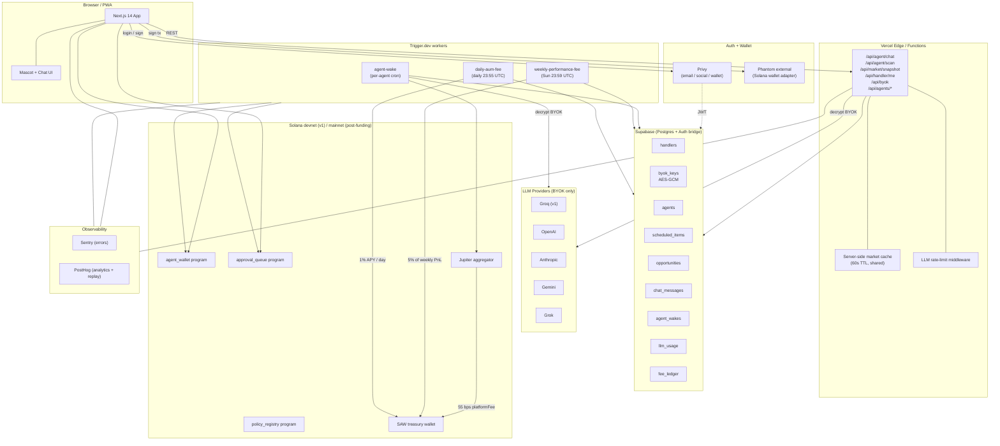
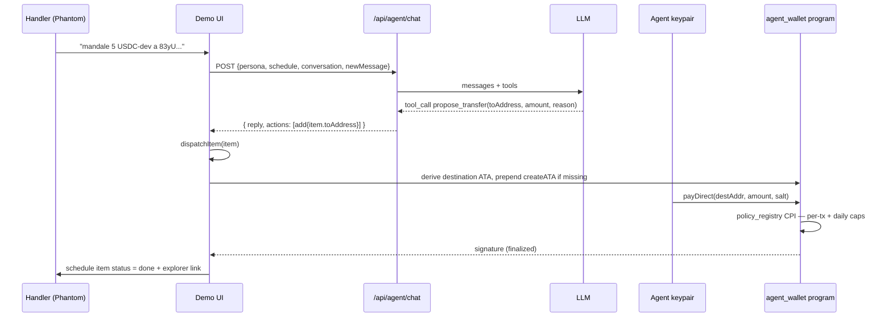
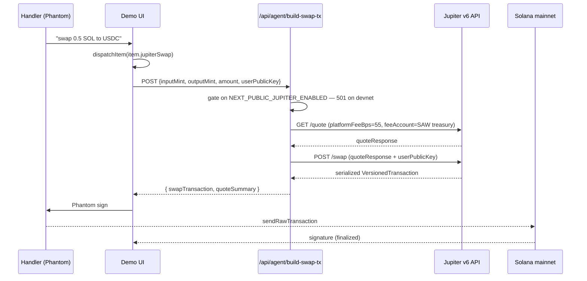

# SAW Architecture

## System diagram



## Module map

```
saw/
├── programs/                    Anchor on-chain code (Rust)
│   ├── agent_wallet/
│   ├── policy_registry/
│   └── approval_queue/
├── sdk/                         @asastuai/saw-sdk (TypeScript)
│   ├── client.ts                SawClient
│   ├── wallet-handle.ts         WalletHandle
│   ├── policy.ts                Policy helpers
│   └── pdas.ts                  PDA derivations
├── web/                         @asastuai/saw-web (Next.js 14)
│   ├── app/
│   │   ├── api/
│   │   │   ├── agent/{chat,scan,wake}/route.ts
│   │   │   ├── byok/route.ts
│   │   │   ├── handler/me/route.ts
│   │   │   └── market/snapshot/route.ts
│   │   ├── demo/page.tsx
│   │   ├── dashboard/page.tsx          [P4]
│   │   └── layout.tsx
│   ├── components/
│   │   ├── privy-provider.tsx
│   │   ├── mascot.tsx
│   │   ├── chat.tsx
│   │   ├── schedule-view.tsx
│   │   ├── opportunity-reel.tsx
│   │   ├── api-key-modal.tsx
│   │   ├── creator-note.tsx
│   │   └── error-boundary.tsx
│   ├── lib/
│   │   ├── supabase.ts
│   │   ├── byok-crypto.ts
│   │   ├── fees.ts
│   │   ├── treasury.ts
│   │   ├── jupiter.ts
│   │   ├── posthog.ts
│   │   ├── db/
│   │   │   ├── types.ts
│   │   │   ├── handlers.ts
│   │   │   ├── agents.ts
│   │   │   ├── schedule.ts
│   │   │   ├── opportunities.ts
│   │   │   ├── chat.ts
│   │   │   ├── byok.ts
│   │   │   ├── fees.ts
│   │   │   └── llm.ts
│   │   └── providers/
│   │       ├── types.ts
│   │       ├── groq.ts
│   │       └── index.ts          (registry)
│   └── sentry.{client,server,edge}.config.ts
├── worker/                      @asastuai/saw-worker (Trigger.dev)
│   ├── trigger.config.ts
│   └── src/
│       ├── jobs/
│       │   ├── agent-wake.ts
│       │   ├── weekly-performance-fee.ts
│       │   └── daily-aum-fee.ts
│       └── lib/
│           ├── supabase.ts
│           ├── market.ts
│           └── fees.ts
├── db/
│   └── migrations/
│       └── 0001_init.sql
├── docs/
│   ├── architecture.md
│   ├── security-model.md
│   └── fee-model.md
└── ROADMAP.md
```

## Data ownership

| Layer | Owns | Reads from | Writes to |
|---|---|---|---|
| Browser | UI state, ephemeral form data | API routes | API routes only |
| API routes | request handling, RLS-bound queries | Supabase (anon, via Privy JWT) | Supabase (service role for cross-handler ops) |
| Worker jobs | agent runtime, fee collection | Supabase (service role), on-chain | Supabase (service role), on-chain |
| On-chain programs | custody, policy enforcement | — | — |

## Critical invariants

1. **Plaintext BYOK keys never leave the server's RAM.** Encrypted at rest in Supabase (AES-GCM), decrypted only inside the worker / API route that needs them.
2. **RLS on every table.** Handlers can only see their own data via Privy JWT. Service role (workers) bypasses for system operations.
3. **No agent acts without a registered policy on-chain.** The agent wallet program enforces this; the worker cannot circumvent.
4. **All fees recorded in fee_ledger before/after on-chain collection.** Single source of truth for revenue.
5. **Cron cadence is per-agent.** No global "tick" that fires all agents at once — they wake on independent schedules to spread load.

---

## v1.3 changes (current)

### Unified Operative model

Three persona personas (Greedie / Conservador / Estable) collapsed into a single Operative per handler. Handler picks a custom codename in settings; the LLM context adapts intent (trade / yield / save) per message. Old persona rows kept readable for back-compat but new setups only mint an `operative`.

**Why:** the persona switcher added cognitive load with little upside — one chat handling all three skills is the natural product.

### Real on-chain transfer to arbitrary address (`propose_transfer`)

New LLM tool exposes `propose_transfer(toAddress, amount, reason)`. When the handler says "mandale 5 USDC-dev a `<pubkey>`", the Operative validates the address shape, queues a `ScheduleItem` with `item.toAddress` set, and `dispatchItem` routes the `payDirect` (or `requestPayment` + `approveAndExecute` above threshold) to the ATA derived from that address — creating the ATA on the fly if it doesn't exist (agent pays rent from its gas SOL).

End-to-end verified on devnet (sig `QCn46M6gZfQaYzXr9b3DzNSKp1xXRUEySZqwY1FB14iA4MtqmkWe8fwzZsv4jwDnTNrmtqjedCk2bR9Ag3VjwGz`, finalized). On-chain policy enforces per-tx + daily caps + approval threshold regardless of destination.

### Jupiter swap adapter (mainnet-gated)

New LLM tools:
- `get_jupiter_quote(inputSymbol, outputSymbol, amountLamports, slippageBps)` — always calls Jupiter v6 quote API for real mainnet pricing. Works on devnet too (read-only, no liquidity needed).
- `propose_jupiter_swap(...)` — queues a swap as a `ScheduleItem` with `jupiterSwap` descriptor.

The execute path is gated by `NEXT_PUBLIC_JUPITER_ENABLED`. On devnet (current) the queue accepts the item but `dispatchItem` returns a visible "mainnet pending" error. Mainnet deploy flips the flag and the same flow executes for real.

Server endpoint `POST /api/agent/build-swap-tx` builds the Jupiter tx with `platformFeeBps: 55` routed to `getTreasuryAddressString()` — the platform fee accrues to SAW on every swap.

### LLM provider tool-calling ranking

`/api/agent/chat` reorders the SAW-credits provider chain by tool-calling quality before invoking the LLM:

`cerebras > groq > anthropic > openai > grok > kimi > deepseek > gemini`

Why: Gemini Flash-Lite (cheap, free RPD tier) is weak with function calls in chat history with prior tool-success references — it generates `"Listo, propuse..."` text without emitting the tool call, leaving the schedule unchanged. Reorder pushes strong tool callers (Cerebras gpt-oss-120b, Groq llama-4) to the front so tools actually fire. Gemini stays in the chain as last-resort fallback only on transient errors.

BYOK keys (single-entry chains) are not reordered — that's the user's explicit choice.

### Security headers + audit pre-push

`next.config.mjs` now sets `X-Frame-Options: DENY`, `X-Content-Type-Options: nosniff`, `Referrer-Policy: strict-origin-when-cross-origin`, `Permissions-Policy` lock-down. Verified live in production.

14-bug internal audit closed before public push: 3 CRITICAL + 6 HIGH + 4 MEDIUM, zero open. Report at `docs/security-audit-v1.3.md`. JWT signature verification (CRITICAL pre-fix), wallet-claim immutability, internal-auth handler validation, IDOR closures on schedule + opportunities, topup signer check, anchor program hardenings (`require!(amount > 0)`, `validate_params`, `prune_expired_request`, `reset_daily_spent`).

---

## End-to-end flow: `propose_transfer` (verified on devnet)



## End-to-end flow: Jupiter swap (mainnet-gated)



---

## Perps — Phase 1 (Adrena venue)

### Venue history

| Date | Event |
|------|-------|
| 2026-06-11 (original spec) | Drift chosen as v1 venue |
| 2026-06-11 (Task 1 spike) | Drift devnet found broken — program frozen ~19-Apr, user-facing ixs disabled, oracles 69 days stale |
| 2026-06-11 (Task 1b addendum) | Pivot to localnet-clone of Drift mainnet; abandoned when exploit discovered |
| 2026-06-11 (Task 1c addendum) | **Drift exploited ~$285-295M (1-Apr-2026, UNC4736/DPRK)** — mainnet shim, devnet frozen, relaunch undated. Pivot to **Adrena (devnet → localnet-clone for testing)** for v1; **Jupiter Perps ($660M TVL) slated for mainnet prod** |
| 2026-06-11 (Task 1d addendum) | Adrena devnet also empty (7 accounts vs ~6,887 mainnet). Final approach: **localnet with Adrena mainnet-clone** via `solana-test-validator --clone` |
| 2026-06-12 | Full e2e green on localnet — long + short open/close with SL/TP on-chain. See `docs/DEMO-RESULTS-perps.md` |

**VenueAdapter abstraction** (`worker/src/lib/venue.ts`) means blast radius = 1 module for future venue swaps. Jupiter Perps drops in behind the same interface.

### Dispatch flow

```
NL chat: "Abrime un long de SOL x4 con 300 USDC si baja hasta 64"
        │
        ▼
/api/agents/[id]/chat  ──  new tool: propose_perp_open  (greedie persona only)
  → TradeIntent { market, side, leverage, marginUsdc, trigger, stopLoss?, takeProfit? }
        │
        ▼
POLICY PRE-CHECK  (web/lib/perp-policy.ts — mirrors worker copy)
  maxLeverage · maxMarginPerTx · dailyMarginBudget · allowedMarkets
  maxOpenPositions · requireStopLoss · approvalThresholdMargin
  → above approval threshold → status: awaiting-approval (human gate)
  → within limits         → status: queued
        │
        ▼
SCHEDULE  (scheduled_items row, action_type = 'perp-open')
  descriptor: { market, side, leverage, marginUsdc, stopLoss?, takeProfit?, clientOrderId }
  trigger:    { kind: below|above|dip, asset, price, deadline? }
  UI echo before enqueue:
    "LONG SOL-PERP ×4 · margin 300 USDC
     entrada: SOL ≤ $64.00 · SL $58.00 · liq est. ~$49.60
     policy: ✓ leverage ✓ margin ✓ budget ⚠ excede threshold → requiere aprobación"
        │
        ▼ (worker agent_wake: trigger fires when price crosses)
dispatchPerpItem  (worker/src/lib/dispatch-perp.ts)
  1. Atomic claim:  UPDATE ... SET status='executing' WHERE id=X AND status='queued'
     → 0 rows updated → another wake claimed it; exit (note M-5)
  2. Policy re-check at fire time (budget may have changed since enqueue)
  3. Oracle gap guard: if oracle deviated >1.5% beyond trigger price → skipped
  4. Dup guard: clientOrderId (deterministic from item UUID) already open → skipped
  5. ensureDeposited (idempotent USDC check)
  6. VenueAdapter.openPerp() → on-chain tx confirmed
  7. VenueAdapter.getPositions() → read entry/mark/SL/TP/liqPrice → persist to DB
  8. status = 'done' + tx_signature written
        │
        ▼
SL/TP orders (native + atomic on venue)
  Placed in the SAME transaction as the entry (one tx bundle via low-level instruction builders).
  Keeper-executed by the venue's keeper network — survive worker downtime.
  On localnet: keepers are absent; acceptance of the ixs is verified (execution on mainnet only).
```

For close orders (`action_type = 'perp-close'`): same dispatch path, calls `VenueAdapter.closePerp()` + cancels orphaned SL/TP. If the position was already closed by a keeper (SL/TP hit), `alreadyClosed` guard fires → `skipped` cleanly.

### Key safety properties

| Property | Mechanism |
|----------|-----------|
| Policy enforced server-side | `evaluatePerpPolicy` runs in API route before enqueue AND re-runs in worker at fire time |
| Human-in-the-loop | `approvalThresholdMargin` — orders above the USDC threshold require explicit `approved: true` flag before worker will execute |
| SL/TP survive worker downtime | Orders live on the venue (keeper-executed), not in SAW's cron |
| No auto-retry | On any failure, status → `failed` + `error_message`. With leverage, a surprise retry is a bug. Agent re-proposes if needed. |
| Trading key encrypted at rest | AES-GCM, stored in `agent_trading_keys` (service-role only, no RLS grants to anon/authenticated). Never leaves server RAM as plaintext. |
| Hard collateral bound | Trading float is a small dedicated ATA separate from the agent's main treasury. Even if off-chain policy failed entirely, max loss = float deposited. |
| `requireStopLoss: true` by default | Policy rejects any open intent without a stop-loss at both pre-check and at fire time. |

### Environment variables

| Variable | Default | Description |
|----------|---------|-------------|
| `VENUE` | _(unset — disabled)_ | Venue identifier. Set to `adrena` to enable. Unset = venue disabled; no perp dispatch. |
| `VENUE_ENV` | _(unset)_ | Runtime environment: `localnet`, `devnet`, or `mainnet-dust`. Unset = venue disabled. |
| `VENUE_RPC_URL` | _(unset)_ | RPC endpoint for the venue. E.g. `http://127.0.0.1:8899` for localnet. |
| `VENUE_ALLOW_MAINNET_DUST` | `false` | Must be set to `true` to allow mainnet execution (dust-run gate). Protects against accidental mainnet spend. |
| `SAW_BYOK_ENC_KEY` | _(required)_ | 32-byte AES-GCM key (base64) for encrypting BYOK LLM keys and trading keypairs at rest. Same key used for both. Generate: `openssl rand -base64 32` |

**Safe defaults:** all perp functionality is disabled if `VENUE` and `VENUE_ENV` are unset. No on-chain perp transactions will be attempted.

### Live e2e proof

Full dispatch path exercised on localnet (long open/close + short open/close, SL/TP confirmed on-chain, alreadyClosed guard verified):

- `docs/DEMO-RESULTS-perps.md` — tx signatures, position reads, oracle prices

Localnet runbook (one-command setup): `scripts/localnet-adrena/README.md`

### Not in Phase 1 / pending

| Item | Status | Notes |
|------|--------|-------|
| Mainnet dust run | Pending (post-Phase 1) | Validates keeper-executed SL/TP — localnet has no keepers. Gated by `VENUE_ALLOW_MAINNET_DUST=true`. Requires ~5-10 USDC real float. |
| Column-default jsonb fix for FUTURE agents | **Done** | `createAgent()` in `web/lib/db/agents.ts` now always includes `perp_policy` in the INSERT payload, defaulting to `DEFAULT_PERP_POLICY` if `perpPolicy` is not provided. Optional `perpPolicy?: PerpPolicyParams` added to input type. Agents spawned after migration 0014 will always get a valid policy row. |
| I-1: stuck-'executing' reconciler | **Done** | `reconcileStuckExecuting(db, agentId)` exported from `dispatch-perp.ts`. Called at the top of every `agent-wake` run before processing pending items. Finds rows for this agent where `status=executing AND created_at < now()-10min`, marks them `failed` with message "reconciled: stuck in executing (worker died mid-dispatch?) — verify position manually". Uses `created_at` as a conservative proxy (no `claimed_at` column). Never auto-retries. |
| M-2: oracle gap guard inactive for dip triggers | **Done** | `effectiveTriggerPrice(item, oracle)` extracted as exported helper in `dispatch-perp.ts`. For `dip` triggers it now computes `basis*(1-drop/100)` instead of falling through to oracle (which made gap=0 and silently disabled the guard). The 1.5% gap guard is now active for all trigger kinds. |

